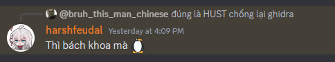

# HUST - VGU Cypher CTF for beginner

- Write-up by [Qân](https://github.com/CallMeQan)
- Thuộc phần **Reverse**

## Đánh giá

- Bài này chống Ghidra, theo lời của anh [harshfeudal](https://discord.com/users/622450109317251088) <(")



- Tóm lại mở file bằng Ghidra không được.

## Giải siêu nhanh

- Vì mình hay đi đọc trộm source code của các phần mềm khác nhau nên mình biết file này được viết bằng C#. Vì thế mình liền bật [Jetbrains dotPeek](https://www.jetbrains.com/decompiler/) và ném file vào đó.

- Trong source code đó sẽ có biến `values` mà toàn số không, thế nên mình sử dụng **kỹ thuật tối thượng <(")** mang tên **Ctrl C, Ctrl V đút cho ChatGPT** và xong

=> **Đã tìm được flag**

### Code solution by ChatGPT

```python
values = [] # Place here

decoded_chars = []
for i, val in enumerate(values, 1):
    ascii_val = (val - i) // 3
    decoded_chars.append(chr(ascii_val))

print(''.join(decoded_chars))
```
